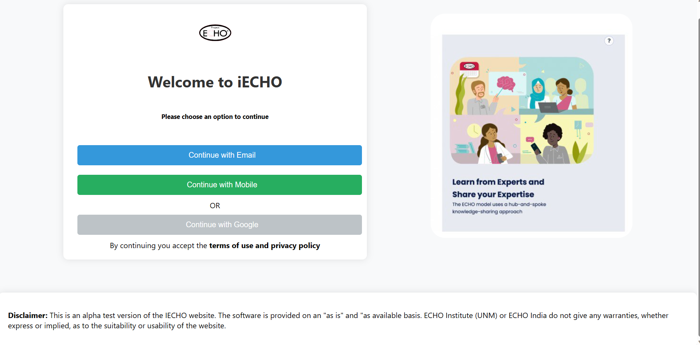

# Echo India Website

Welcome to the Echo India website repository! This repository contains the source code for the Echo India website.


## Table of Contents
- [Description](#description)
- [Features](#features)
- [Setup](#setup)
- [Usage](#usage)
- [Contributing](#contributing)
- [License](#license)

## Description

This website is designed for the iECHO platform, providing users with options to continue using their preferred method (Email, Mobile, Google). The repository includes HTML, CSS, and JavaScript files.

## Features

- Continue with Email
- Continue with Mobile
- Continue with Google (disabled in this version)
- Responsive design
- Alpha version disclaimer

## Setup

1. Clone the repository:

    ```bash
    git clone https://github.com/your-username/echo-india-website.git
    ```

2. Open `index.html` in your web browser.

## Usage

Choose an option to continue and explore the website. This version is an alpha test, and please refer to the disclaimer.

## Contributing

Feel free to contribute by opening issues or submitting pull requests.

## License

This project is licensed under the [MIT License](LICENSE).
